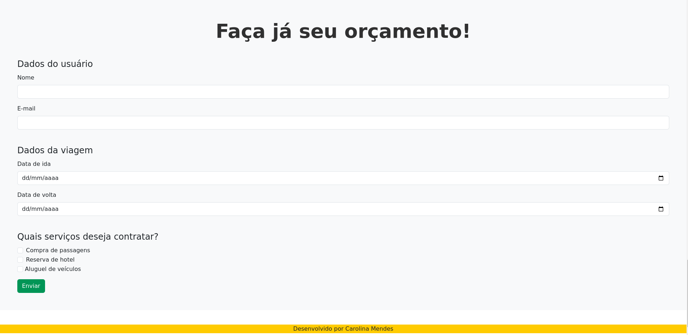

# Your Trip

Projeto, para fins de aprendizado, de um site de compras de pacotes de viagens. Foi feito no bootcamp do Instituto Nu by Descomplica, de Fundamentos de Desenvolvimento Web Front-end, no módulo de HTML, CSS e Bootstrap.

### Tecnologias utilizadas
1. HTML
2. CSS
3. Bootstrap

### Como rodar este projeto
1. Faça um clone deste repositório:
```bash
git clone https://github.com/carolcampos22/projeto-your-trip.git
```
ou baixe o arquivo ZIP.

2. Entre na pasta do projeto

3. Abra o arquivo index.html no navegador

Como o site não foi feito utilizando JavaScript ou outra linguagem de programação, ele não é funcional. 
Ao clicar no botão "Reservar" nos cards, aparecerá um modal com duas opções:
- Contiuar comprando, que o fechará e você poderá continuar navegando na página atual;
- Finalizar compras, que o levará à página de pagamento.

### Layout
1. Homepage:




2. Página de Pagamento


### Link do site
O site pode ser visualizado no link: https://coherent-passenger.surge.sh

### Autora
#### Carolina Mendes - Web developer
[](https://www.linkedin.com/in/dev-carolina-mendes/)
